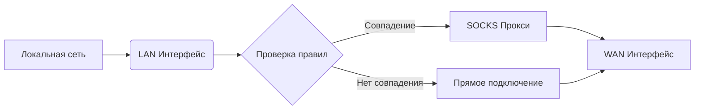

# 🌐 Прозрачный шлюз с SOCKS-проксированием

Шлюз для перенаправления трафика через SOCKS-прокси на основе списка доменов. Решение для организации безопасного доступа и мониторинга сетевой активности. 🔒

## ✨ Особенности

- 🚀 Автоматическое перенаправление трафика для заданных доменов/IP через прокси  
- 🔌 Поддержка различных типов WAN-подключений:
  - 🏠 DHCP
  - 🌍 Статический IP
  - 📡 PPPoE
  - 🔗 L2TP
- 🔄 Динамическое обновление IP-адресов доменов
- 🛡️ Интеграция с SOCKS5 прокси
- 📜 Логирование всех операций
- 🔧 Модульная архитектура с поддержкой параметров командной строки

## 🖥️ Требования

- Сервер/ПК с Linux (рекомендуется Ubuntu 22.04+)
- Два сетевых интерфейса (LAN/WAN)

## 📡 Архитектура системы



## 🚀 Быстрый старт

### 📥 Установка
1. Клонируйте репозиторий:
```bash
git clone https://github.com/Divarion-D/transparent-proxy-gateway.git
cd transparent-proxy-gateway
```

2. Запустите установку:
```bash
chmod +x proxy.sh
sudo ./proxy.sh --install
```

3. Следуйте инструкциям на экране:
   - 🖧 Выберите LAN и WAN интерфейсы
   - 🔌 Настройте тип WAN-подключения

### ⚙️ Конфигурация

1. Добавьте домены в `config/domains.txt`:
```bash
sudo nano config/domains.txt
```

2. Добавьте IP в `config/ips.txt`:
```bash
sudo nano config/ips.txt
```

3. Настройте прокси в `config/redsocks.conf`:
```bash
sudo nano config/redsocks.conf
```

```ini
redsocks {
    local_ip = 0.0.0.0; # Не изменять
    local_port = 12345; # Не изменять
    ip = proxy_ip; # Адрес SOCKS-прокси
    port = proxy_port; # Порт прокси
    # login = proxy_login; # Имя пользователя прокси
    # password = proxy_password; # Пароль прокси
    type = socks5;
}
```

Раскомментируйте строки с логином и паролем если требуется аутентификация:
```
login = proxy_login;
password = proxy_password;
```

4. Примените изменения:
```bash
sudo ./proxy.sh --update-ips
```

## 🛠️ Использование

### 🔑 Основные команды

| Команда                     | Описание                          |
|-----------------------------|-----------------------------------|
| `sudo ./proxy.sh --install` | 🚀 Полная установка системы       |
| `sudo ./proxy.sh --wan`     | 🔄 Перенастройка WAN-подключения  |
| `sudo ./proxy.sh --update-ips`  | 🌍 Принудительное обновление IP и перезапуск REDSOCKS  |
| `sudo ./proxy.sh --help`    | 📖 Показать справку               |

### 📌 Примеры

1. 🔄 Обновить список IP-адресов:
```bash
sudo ./proxy.sh --update-ips
```

2. ⚙️ Изменить тип WAN-подключения:
```bash
sudo ./proxy.sh --wan
```

3. 🔍 Проверить статус сервисов:
```bash
systemctl status redsocks
```

4. 📋 Проверить добавленные IP-адреса доменов:
```bash
ipset list proxy_domains
```

## 📂 Структура проекта

```
/transparent-proxy-gateway/
├── proxy.sh              # 🖥️ Основной скрипт
├── config.sh             # 🖥️ Главный файл конфигурации
├── config/
│   ├── redsocks.conf     # ⚙️ Конфигурация прокси
│   ├── domains.txt       # 📜 Список доменов для перенаправления
│   ├── ips.txt           # 📜 Список IP для перенаправления
│   └── cache.txt         # 📜 Кеш с обработаными IP для перенаправления
├── scripts/
│   └── update_ips.sh     # 🔄 Скрипт обновления IP
└── logs/                 # 🗂️ Директория логов
```

## 📊 Логирование

Все операции записываются в папку `logs/`. Для мониторинга в реальном времени:

```bash
tail -f logs/redsocks/redsocks.log
```

## ❓ Частые вопросы

### ❌ Нет интернет-доступа после настройки
1. 🔌 Проверьте физическое подключение кабелей
2. ⚙️ Убедитесь в правильности выбора WAN-интерфейса
3. 🕵️‍♂️ Проверьте настройки прокси в `redsocks.conf`

### 🚫 Домены не перенаправляются
1. 📝 Убедитесь, что домены добавлены в `domains.txt`
2. 🔄 Выполните принудительное обновление IP:
```bash
sudo ./proxy.sh --update-ips
```

### ⚠️ Ошибки в конфигурации
Проверьте синтаксис файлов:
```bash
redsocks --test -c config/redsocks.conf
```

## 📜 Лицензия

AGPL License. Подробнее см. в файле [LICENSE](LICENSE).

---

**💻 Разработано**: Divarion-D  
**📂 Репозиторий**: https://github.com/Divarion-D/transparent-proxy-gateway

