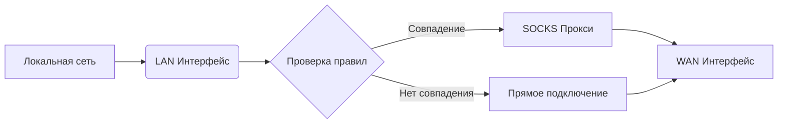

# 🌐 Прозрачный шлюз с SOCKS-проксированием  
**Умный маршрутизатор трафика через динамические правила с полной поддержкой IPv4/IPv6**  

[](https://www.gnu.org/licenses/agpl-3.0)


Автоматически перенаправляет трафик через SOCKS5-прокси с поддержкой современных сетевых стандартов. Идеально для обхода ограничений и мониторинга сети.

## ✨ Особенности

- 🚀 **Автоматическое перенаправление трафика** для заданных доменов/IP через прокси  
- 🔌 **Поддержка различных типов WAN-подключений**:
  - 🏠 DHCP
  - 🌍 Статический IP
  - 📡 PPPoE
  - 🔗 L2TP
- 🔄 **Динамическое обновление IP-адресов доменов**
- 🛡️ **Интеграция с SOCKS5 прокси**
- 📜 **Логирование всех операций**
- 🔧 **Модульная архитектура с поддержкой параметров командной строки**
- ⏰ **Автоматическое обновление адресов** каждые 3 часа
- 🌐 **Поддержка IPv4, IPv6 и CIDR-диапазонов** для гибкости в настройках

## 🖥️ Требования

- Сервер/ПК с Linux (рекомендуется Ubuntu 22.04+)
- Два сетевых интерфейса (LAN/WAN)

## 📡 Архитектура системы



## 🚀 Быстрый старт

### 📥 Установка
1. Клонируйте репозиторий:
```bash
git clone https://github.com/Divarion-D/transparent-proxy-gateway.git
cd transparent-proxy-gateway
```

2. Запустите установку:
```bash
chmod +x proxy.sh
sudo ./proxy.sh --install
```

3. Следуйте инструкциям на экране:
   - 🖧 Выберите LAN и WAN интерфейсы
   - 🔌 Настройте тип WAN-подключения

### ⚙️ Конфигурация

* ⚠️ Каждая новая запись должна начинаться с новой строки

1. Добавьте домены в `config/domains.txt`:
```bash
sudo nano config/domains.txt
```

2. Добавьте IP в `config/ips.txt` (поддерживаются как одиночные IP, так и CIDR-диапазоны):
```bash
sudo nano config/ips.txt
```

3. Настройте прокси в `config/redsocks.conf`:
```bash
sudo nano config/redsocks.conf
```

```ini
redsocks {
    local_ip = 0.0.0.0; # Не изменять
    local_port = 12345; # Не изменять
    ip = proxy_ip; # Адрес SOCKS-прокси
    port = proxy_port; # Порт прокси
    # login = proxy_login; # Имя пользователя прокси
    # password = proxy_password; # Пароль прокси
    type = socks5;
}
```

Раскомментируйте строки с логином и паролем если требуется аутентификация для прокси:
```
login = proxy_login;
password = proxy_password;
```

4. Примените изменения:
```bash
sudo ./proxy.sh --update-ips
sudo ./proxy.sh --restart-redsocks
```

## 🛠️ Использование

### 🔑 Основные команды

| Команда                     | Описание                          |
|-----------------------------|-----------------------------------|
| `sudo ./proxy.sh --install` | 🚀 Полная установка системы       |
| `sudo ./proxy.sh --uninstall` | 🚀 Полное удаление шлюза        |
| `sudo ./proxy.sh --wan`     | 🔄 Перенастройка WAN-подключения  |
| `sudo ./proxy.sh --update-ips`  | 🌍 Принудительное обновление IP  |
| `sudo ./proxy.sh --restart-redsocks`    | 🌍 Перезапуск readsocks  |
| `sudo ./proxy.sh --reconfigure_firewall` | 🛡️ Переконфигурация фаервола
| `sudo ./proxy.sh --help`    | 📖 Показать справку               |

## 📌 Добавление правил роутинга

Правила роутинга можно взять отсюда [RockBlack-VPN](https://github.com/RockBlack-VPN/ip-address/tree/main/Global) или [Диапазоны](https://rockblack.pro/vpn/dopolnitelno/diapazon-ip-adresov)

1. Выбираем сайт, который нам нужен.
2. Открываем файл с правилами.
3. Содержимое файла будет выглядеть примерно так:
```
route ADD 23.32.0.0 MASK 255.224.0.0 0.0.0.0
route ADD 47.236.0.0 MASK 255.252.0.0 0.0.0.0
route ADD 47.235.0.0 MASK 255.255.0.0 0.0.0.0
```
4. Нужно удалить все, кроме самого IP-адреса, чтобы выглядело так:
```
23.32.0.0
47.236.0.0
47.235.0.0
```
5. Сохраните эти правила в текстовый файл и положите его в папку `routing`.
6. Выполните команду для обновления правил роутинга:
```
sudo ./proxy.sh --update-ips
```

## 📂 Структура проекта

```
/transparent-proxy-gateway/
├── proxy.sh              # 🖥️ Основной скрипт
├── config.sh             # 🖥️ Главный файл конфигурации
├── config/
│   ├── redsocks.conf     # ⚙️ Конфигурация прокси
│   ├── domains.txt       # 📜 Список ваших доменов для перенаправления
│   ├── ips.txt           # 📜 Список ваших IP для перенаправления
│   ├── cache_v4.txt      # 📜 Кеш с обработанными IPv4 для перенаправления (не трогать, генерируется автоматически)
│   └── cache_v6.txt      # 📜 Кеш с обработанными IPv6 для перенаправления (не трогать, генерируется автоматически)
├── scripts/
│   └── update_ips.sh     # 🔄 Скрипт обновления IP
├── routing/              # 📜 Файлы с IP-адресами для сайтов
└── logs/                 # 🗂️ Директория логов
```

## 📊 Логирование

Все операции записываются в папку `logs/`. Для мониторинга в реальном времени:

```bash
tail -f logs/redsocks/redsocks.log
```

## 🔍 Проверка работоспособности DHCP-сервера

Если клиенты получают IP-адреса, но интернет отсутствует, выполните следующие проверки:

### 1. Статус службы DHCP
```bash
sudo systemctl status isc-dhcp-server
# Должен быть активен (active)
```

### 2. Проверка арендованных адресов
```bash
sudo cat /var/lib/dhcp/dhcpd.leases
# Должны отображаться выданные клиентам IP
```

### 3. Конфигурация DHCP
```bash
sudo cat /etc/dhcp/dhcpd.conf
# Проверьте наличие:
# - Правильного диапазона (range)
# - Корректного шлюза (option routers)
```

### 4. Тест выдачи IP
```bash
sudo dhclient -v -r $LAN_IFACE  # Сброс текущего DHCP
sudo dhclient -v $LAN_IFACE     # Новая попытка получения IP
```

### 5. Проверка связи с шлюзом
```bash
# На клиенте:
ping 10.0.0.1
# Если недоступно:
# - Проверьте кабельное подключение
# - Убедитесь в правильности выбора LAN-интерфейса
```

### 6. Логирование DHCP
```bash
sudo journalctl -u isc-dhcp-server -f
# Ищите ошибки выделения адресов
```

### 7. Проброс DNS-запросов
```bash
# На клиенте:
sudo nslookup google.com 10.0.0.1
# Должен вернуть IP-адрес
```

---

## 🛠️ Типичные проблемы DHCP

### ❌ Клиенты не получают IP
1. Проверьте привязку к интерфейсу:
```bash
sudo cat /etc/default/isc-dhcp-server
# INTERFACESv4 должно содержать $LAN_IFACE
```

2. Перезапустите службу:
```bash
sudo systemctl restart isc-dhcp-server
```

### ❌ Конфликт IP-адресов
Добавьте резервацию:
```bash
host printer {
    hardware ethernet 00:1A:2B:3C:4D:5E;
    fixed-address 10.0.0.50;
}
```

---

## 🔄 Полная диагностика сети
Выполните на шлюзе:
```bash
./proxy.sh --reconfigure_firewall && \
systemctl restart isc-dhcp-server redsocks
```

После проверок не забудьте сохранить изменения:
```bash
netfilter-persistent save
```

**Примечание:** Для применения всех изменений может потребоваться перезагрузка клиентов.


## ❓ Частые вопросы

### ❌ Нет интернет-доступа после настройки
1. 🔌 Проверьте физическое подключение кабелей
2. ⚙️ Убедитесь в правильности выбора WAN-интерфейса
3. 🕵️‍♂️ Проверьте настройки прокси в `redsocks.conf`
4. 📋 Проверить добавленные IP-адреса доменов:
```bash
sudo ipset list proxy_domains
```
5. 📋 Проверить созданы ли правила роутинга:
```bash
sudo nft list ruleset
# Должно быть:
# - POSTROUTING
# - PREROUTING
# - PROXY_ROUTE
```
6. 📋 Проверить созданы ли настройки firewall
```bash
sudo iptables -t nat -L -nv

# Должно быть:
# - POSTROUTING MASQUERADE
# - PREROUTING REDIRECT
# - PROXY_ROUTE
```

### 🚫 Домены не перенаправляются
1. 📝 Убедитесь, что домены добавлены в `domains.txt`
2. 🔄 Выполните принудительное обновление IP:
```bash
sudo ./proxy.sh --update-ips
```

### ⚠️ Ошибки в конфигурации
Проверьте синтаксис файлов:
```bash
redsocks --test -c config/redsocks.conf
```

## 📜 Лицензия

AGPL License. Подробнее см. в файле [LICENSE](LICENSE).

---

**💻 Разработано**: Divarion-D  
**📂 Репозиторий**: [https://github.com/Divarion-D/transparent-proxy-gateway](https://github.com/Divarion-D/transparent-proxy-gateway)

